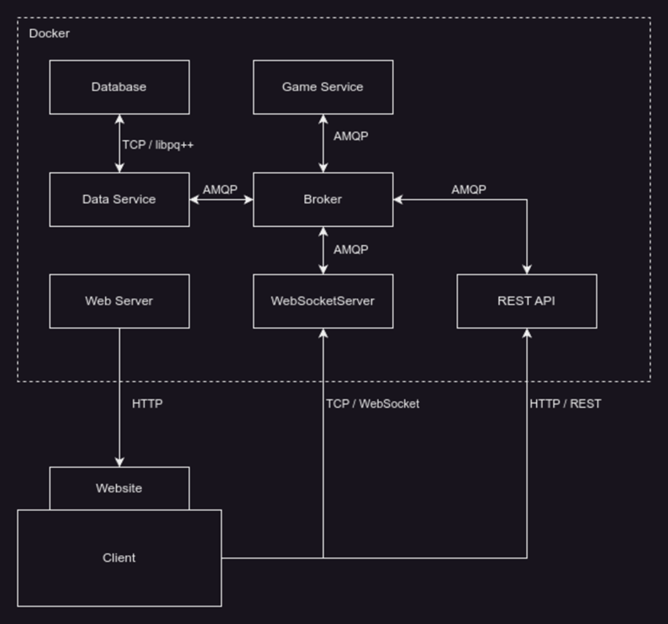

# Monopoly 2.0

## Benutzung

Um die Applikation zu bauen und starten folgenden Befehl ausführen.  
Nachdem die Container erstellt wurden, werden die Dienste hochgefahren. Dies kann eine gewisse Zeit dauern.

```bash
git submodule update --init --recursive
docker compose up -d
```
## Entwicklung

Bevor am Projekt gearbeitet werden kann sollte zuerst sichergestellt werden, dass
alle Git-Submodule geladen und aktuell sind. Dazu kann folgender Befehl auf der
Konsole ausgeführt werden:

```bash
git submodule update --init --recursive
```

## Architektur



### Die Funktionsweise unseres Systems

**Database**: Diese Komponente speichert Daten persistent in einer PostgreSQL Datenbank.  
Dazu gehören Räume, Spieler, Spiele und Grundstücke. Die Datenbank wird direkt vom Data-Service, mithilfe der libpq++
Bibliothek angesprochen.

**Data Service**: Dieser Service fungiert als Schnittstelle zur Datenbank. Er erhält mittels AMQP Befehle vom Broker und
bearbeitet diese.

**Game Service**: Dieser Service ist für die Spiel-Logik verantwortlich. Er verarbeitet Spielereignisse und -aktionen.
Er
kommuniziert ebenfalls über AMQP mit dem Broker. Dabei erhält er Befehle vom Spieler über den WebSocket und sendet
Befehle an den Data-Service.

**Broker**: Der Broker koordiniert den Nachrichtenaustausch zwischen den verschiedenen Services (Game Service, Data
Service,
WebSocket Service und REST Service). Er sorgt dafür, dass Nachrichten über AMQP korrekt an die jeweiligen Empfänger
weitergeleitet werden. Dies ermöglicht eine asynchrone Kommunikation und entkoppelt die verschiedenen Services.

**WebSocket Service**: Dieser Service ermöglicht Clients eine WebSocket-Verbindung aufzubauen. Mit dieser können die
Clients Befehle über den Broker versenden und über Ereignisse informiert werden. Auch hier erfolgt die
Kommunikation mit dem Broker über AMQP.

**REST Service**: Der REST Service stellt HTTP/REST-Schnittstellen zur Verfügung, mit welcher die Clients einen Raum zum
Beitreten auswählen können. Er kann Anfragen von Clients an den Broker
weiterleiten, um Daten zu erhalten oder zu aktualisieren.

**Web Service**: Dieser Service stellt den Clients die Website zur Verfügung.

**Client**: Der Client ist das Endgerät des Benutzers, welches mit der Website interagiert. Über die
Website kommuniziert der Client entweder per HTTP mit dem Web Server oder über WebSockets direkt mit dem WebSocketServer.

[](https://classroom.github.com/a/YfrAWYyB)
