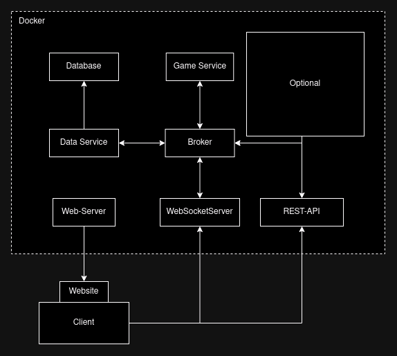

# Monopoly 2.0

## Benutzung

## Entwicklung

Bevor am Projekt gearbeitet werden kann sollte zuerst sichergestellt werden, dass
alle Git-Submodule geladen und aktuell sind. Dazu kann folgender Befehl auf der
Konsole ausgeführt werden:

```bash
git submodule update --init --recursive
```

## Architektur



[](https://classroom.github.com/a/YfrAWYyB)
